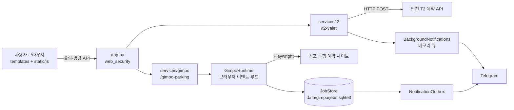

# 코드 구조

어느 코드가 무엇을 맡고, 모듈이 어디서 나뉘는지 설명한다. 기능 동작의 정본은 각 명세이고
이 문서는 코드를 찾아가는 지도다. 김포 기능의 상태·인계·복구 규칙은
[김포공항 예약 기능 명세](plans/2026-09-27-gimpo-reservation.md)를 따른다.

## 실행 모델

한 PC에서 한 사용자가 쓰는 로컬 Flask 앱이다. `python app.py`로 debug와 reloader를 끄고
단일 프로세스로 실행한다. 로그인이 없으므로 요청이 이 PC 브라우저의 이 앱 화면에서 왔는지가
유일한 보안 경계다. `services/web_security.py`가 앱 전체에서 Host를 `localhost`·`127.0.0.1`로
제한하고, 다른 출처의 상태 변경 요청을 거부하고, CSP를 포함한 공통 보안 헤더를 붙인다. CSP는 같은
출처의 스크립트 파일만 실행을 허용하므로 인라인 스크립트·이벤트 속성을 쓰지 않는다.

`app.py`는 조립만 한다. 보안 훅을 걸고, 두 서비스의 Blueprint를 등록하고, 김포 서비스 객체를
`app.extensions["gimpo"]`에 두고, 종료 신호를 받으면 김포 런타임과 T2 알림 큐를 닫는다.

## 폴더

| 경로 | 책임 |
|---|---|
| `app.py` | 앱 조립, 설정 오류 시 종료, 종료 정리 |
| `services/config.py` | 서비스별 TOML 읽기와 공용 검증 도우미([설정 규칙](configuration.md)) |
| `services/web_security.py` | Host 제한, 다른 출처 요청 거부, CSP 등 공통 보안 헤더 |
| `services/t2/` | 인천 T2 발렛 예약: 라우트·예약 API 호출·개인정보 가림(`valet.py`), 반복 워커(`scheduler.py`), 파일 저장(`storage.py`), 입력 검증(`validation.py`) |
| `services/gimpo/` | 김포 예약: HTTP 컨트롤러(`parking.py`), 런타임과 명령(`jobs.py`), 작업 저장소(`store.py`), Playwright 어댑터(`client.py`), 입력 검증(`validation.py`), 설정·비밀값(`config.py`) |
| `services/notifications/` | 공용 텔레그램 알림: 전송과 재시도 정책(`telegram.py`), 메시지 문안(`messages.py`), 메모리 큐(`background.py`), 김포용 영속 발송기(`outbox.py`) |
| `config/` | 서비스별 설정 파일 |
| `templates/`, `static/` | 화면. 아래 "화면" 절 |
| `tests/` | 업무 영역별 테스트([테스트 구조](../tests/README.md)) |
| `scripts/` | 감독되는 테스트 실행기, 리뷰 패키지, 작업 측정([테스트 실행기](test-runner.md)) |

## 인천 T2

예약 API에 HTTP POST를 보내는 단순한 구조다. `valet.py`가 라우트와 호출을 함께 맡는다.

- `Scheduler`가 백그라운드 스레드 하나로 `poll_once`를 설정 주기마다 되풀이하고, HTTP 200을 받으면
  예약 완료 알림을 보내고 멈춘다. 워커 수명은 `Scheduler`가 소유해서, 중지 직후 다시 시작해도 옛
  워커가 이어 돌지 않는다.
- 기본 입력은 `user_data.json`, 호출 기록은 `logs/api_call.log`에 소유자 전용 권한으로 저장한다.
  기록에는 `redact_payload`·`redact_text`로 예약자명·차량번호·휴대폰을 가린 사본만 남긴다.

## 김포

공항 사이트를 실제 브라우저로 진행하고, 결제는 사용자가 그 브라우저에서 직접 한다. 구성 요소가
많은 이유는 브라우저 세션, 결제 요청의 1회 전송, 앱 재시작 복구를 모두 한 프로세스가 책임지기
때문이다.

- `GimpoService`(`parking.py`)가 조립 지점이다. import 때는 워커·브라우저·DB를 만들지 않고, 첫 작업
  API 호출 때 `GimpoRuntime`을 만든다. debug나 reloader 아래에서는 런타임을 만들지 않는다.
- `GimpoRuntime`(`jobs.py`)은 `data/gimpo/runtime.lock`의 OS 파일 잠금으로 단일 프로세스를 보장한다.
  모든 Playwright 객체는 전용 스레드(`gimpo-browser`)의 asyncio 이벤트 루프가 소유하고, Flask 요청
  스레드는 명령을 그 루프에 제출만 한다.
- 명령은 작업의 버전 값을 함께 보낸다. 저장소의 버전과 다르거나 현재 상태에서 허용되지 않는
  명령은 `Conflict`(HTTP 409)로 거절된다.
- `JobStore`(`store.py`)는 SQLite에 작업·알림 이벤트·기본 입력을 저장한다. 활성 작업은 하나만
  허용한다. 브라우저 세션과 예약 비밀번호는 저장하지 않고, 비밀번호는 런타임 메모리에만 둔다.
  시작할 때 `recover`가 이전 실행의 활성 작업을 결제 요청이 나갔을 수 있는지에 따라
  `PAYMENT_RESULT_UNKNOWN` 또는 `INTERRUPTED`로 바꾼다.
- `PlaywrightGimpoClient`(`client.py`)는 화면에 보이는 Chromium을 띄우고 모든 요청을 가드 라우트로
  거친다. 결제 준비 요청(`payment.json`)은 봉인해 둔 입력과 같을 때 한 번만 통과시키고, 이미 나갔을
  수 있으면 막는다. 테스트는 `_launch`만 바꿔 이미 떠 있는 브라우저에 붙는다.
- `NotificationOutbox`가 전용 스레드(`gimpo-notifications`)에서 저장소의 알림 이벤트를 읽어 보낸다.
  보내기 전에 이벤트가 현재 작업 상태와 여전히 맞는지 검사하고, 무효가 된 안내에는 정정 알림을
  보낸다.

## 알림

두 서비스가 같은 봇과 수신자, 같은 재시도 정책(`DeliveryPolicy`)을 쓰고, 발송 경로는 둘이다.

| 경로 | 쓰는 곳 | 성질 |
|---|---|---|
| `BackgroundNotifications` | T2 예약 완료, 두 서비스의 테스트 알림 | 크기 제한이 있는 메모리 큐. 앱이 꺼지면 대기 중인 알림은 사라진다 |
| `NotificationOutbox` | 김포 결제 대기 안내와 정정 | SQLite 이벤트 기반. 재시작 때 전송 중이던 이벤트는 결과 불명으로 기록한다 |

## 화면

Jinja 템플릿과 빌드 단계 없는 JS·CSS다.

- `templates/base.html`이 공통 셸이다. 공통 CSS와 `static/js/ui/`의 공통 컴포넌트(API 호출, 오버레이,
  바텀시트, 로그 패널, 상태 배지, 설정 대화상자 등)를 불러오고, 폴링 주기를 `<body>` data 속성으로
  내려 준다.
- `service_base.html`이 두 예약 화면의 공통 틀(상태 배지, 로그 패널)이고, `t2_valet.html` +
  `static/js/app.js`, `gimpo_parking.html` + `static/js/gimpo_parking.js`가 각 서비스 화면이다.
  `landing.html`은 공항 선택 화면이다.
- 설정은 모든 화면에서 여는 레이어 팝업이다. 옛 주소 `/settings/`는 랜딩에서 팝업을 여는 주소로
  돌려보낸다.
- 화면은 상태 API를 주기적으로 폴링해 갱신한다. 서버가 화면으로 먼저 보내는 채널은 없다.
